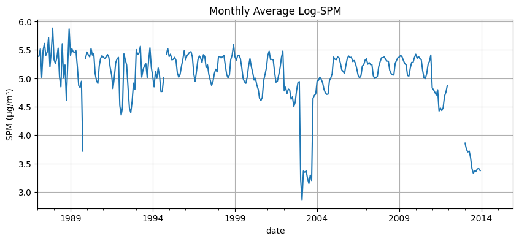
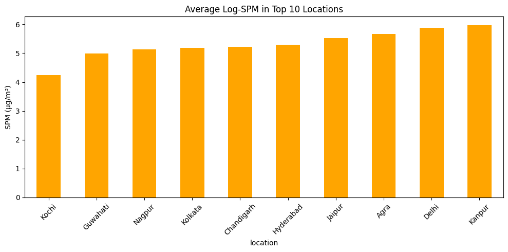

# 🌿 Week 1 – Pollution Drift Predictor (Environmental Monitoring & Pollution Control)

## 📌 Project Theme

This project falls under the theme of **Environmental Monitoring & Pollution Control**, focusing on the prediction and analysis of airborne pollution drift using environmental data. Week 1 lays the foundation by exploring pollutant patterns across Indian cities and establishing baseline models.

---

## 🎯 Objective

To explore and understand a real-world dataset related to air pollution, perform detailed exploratory data analysis (EDA), and build initial regression models to evaluate the predictive potential of available features.

---

## 📦 Dataset Used

- **Source:** Kaggle – [Air Pollution Analysis and Prediction](https://www.kaggle.com/code/guidosalimbeni/air-pollution-analysis-and-prediction)
- **File:** `data.csv`
- **Size:** ~62 MB  
- **Description:** Historical daily ambient air quality data across multiple Indian cities, including pollutants like SO₂, NO₂, PM2.5, SPM, and metadata such as date, location, and state.

---

## 🧪 Exploratory Data Analysis (EDA)

Performed using `week1_model_exploration.ipynb`:

- 📥 Loaded dataset using `pandas`
- 🔍 Explored structure using:
  - `.info()` – data types and non-null counts
  - `.describe()` – statistical summaries
  - `.isnull().sum()` – missing value detection
- 📊 Visualized pollutant distributions:
  - Boxplots for SO₂, NO₂, and SPM
  - Bar charts comparing average SPM across states and top locations
  - Correlation heatmap for SO₂, NO₂, and SPM
  - Time-series plot of monthly average SPM using `date`

---

## 🧠 Modeling & Evaluation

Two models were trained to predict SPM using pollutant features:

### 🔹 Linear Regression (Baseline)

- Features: SO₂, NO₂
- Target: SPM
- Performance:
  - R² Score: **0.1055**
  - MAE: **110.01 µg/m³**
  - Error Percentage: **48.46%**
  - Custom Accuracy (±10%): **12.96%**

### 🔹 Random Forest Regressor (Improved)

- Features: SO₂, NO₂, RSPM (log-transformed)
- Target: SPM (log-transformed)
- Performance:
  - R² Score: **0.6911**
  - MAE: **52.16 µg/m³**
  - Error Percentage: **23.16%**
  - Custom Accuracy (±10%): **40.54%**

> Random Forest significantly outperformed the baseline, capturing nonlinear relationships and reducing prediction error.


---

## 📁 Folder Structure

```
WEEK1/
├── data/
│   └── data.csv                         # Raw pollution dataset
├── models/
│   ├── linear_regression_model.pkl     # Serialized linear regression model ((Not Uploaded, ⚠️ exceeds GitHub size limit))
│   └── random_forest_model.pkl         # Serialized random forest model (Not Uploaded, ⚠️ exceeds GitHub size limit)
├── notebooks/
│   └── week1_model_exploration.ipynb   # EDA, feature selection, and model training
├── outputs/
│   ├── monthly_spm_trend.png           # Visualization of monthly SPM trends
│   ├── top10_spm_locations.png         # Bar chart of top 10 SPM-heavy locations
│   ├── Documentation Week1.docx        # Summary document (editable)
│   └── Documentation Week1.doc         # Legacy version
├── README.md                           # Summary & brief of Week 1 work (You're here)
```

> `⚠️ Model file (linear_regression_model.pkl), (random_forest_model.pkl) not included due to size limits. To reproduce, run week1_model_exploration.ipynb or use the provided training script.`

---

## 📈 Key Visualizations
To support the insights drawn from EDA and modeling, the following plots were generated and saved in the outputs/ folder:

### 🗓️ Monthly SPM Trend

This time-series plot shows the monthly average SPM levels across all recorded locations. It reveals clear seasonal fluctuations, with noticeable peaks during winter months—likely due to increased particulate emissions and lower dispersion rates.



---



---

## 📈 Key Insights

- SO₂, NO₂, and RSPM show strong correlation with SPM, validating their use as predictors
- Pollution levels vary significantly across states and urban locations
- Seasonal trends in SPM are visible through monthly aggregation
- Log transformation improved model stability and reduced skewness
- Random Forest captured complex patterns missed by linear regression

---

## 🛠️ Work Done

- Cleaned and explored the dataset using standard EDA techniques
- Applied log transformation to reduce skewness in pollutant distributions
- Built and evaluated both linear and nonlinear regression models
- Visualized feature relationships, temporal trends, and model performance
- Structured the notebook with markdown summaries and reviewer-friendly plots

---

## 🔮 Future Work

- Expand feature set with categorical and temporal variables
- Tune hyperparameters for Random Forest and explore XGBoost
- Benchmark multiple models and log metrics for comparison
- Deploy final model via Streamlit in Week 3
- Explore geospatial mapping and seasonal drift simulation

---

## 👨‍💻 Author

**Rishit Ghosh**  
🎓 B.Tech in Computer Science and Engineering (AI/ML)  
🏫 Geethanjali College of Engineering and Technology, Telangana, India  
🧠 Focused on modular design, environmental impact, and real-world applications of AI

---

## 📬 Contact

📧 [rishitghosh06@gmail.com](mailto:rishitghosh06@gmail.com)  
🔗 [GitHub Profile](https://github.com/rajghosh06-dev)
