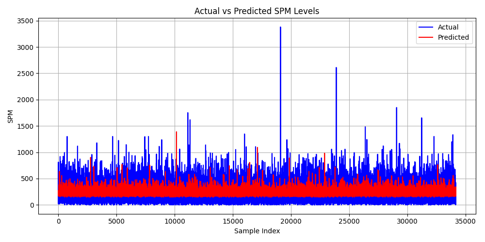
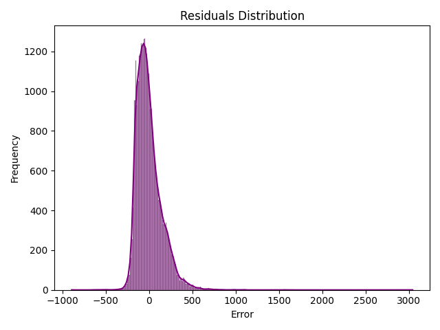
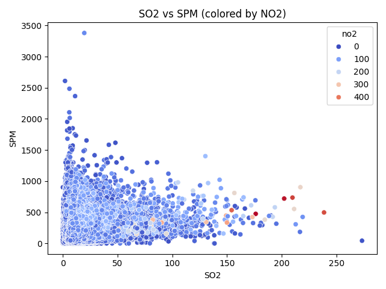

# 🌫️ Week2 - Pollution Drift Predictor (Model Training & Evaluation)  

It focused on building a predictive model to estimate Suspended Particulate Matter (SPM) levels using SO₂ and NO₂ concentrations. The workflow included thorough exploratory data analysis, feature selection, and training a linear regression model with a 70:30 train-test split. Evaluation metrics such as R², MAE, and MSE were computed and logged for transparency. Visualizations and markdown summaries were integrated to ensure clarity and reviewer-friendliness, while the trained model was serialized for downstream deployment in Week 3.

---

## 📌 Overview

Week 2 focuses on building a regression model to predict Suspended Particulate Matter (SPM) using pollutant concentrations, temporal features, and categorical metadata. This module includes:
- Exploratory Data Analysis (EDA)
- Feature engineering and transformation
- Model training and evaluation
- Visual diagnostics and saved outputs
- Modular code structure for reuse and deployment

---

## 🧠 Objectives

- Perform EDA and identify key pollutant and contextual features  
- Engineer temporal and categorical variables for modeling  
- Train a Random Forest Regressor using scikit-learn  
- Evaluate model performance using standard and custom metrics  
- Visualize prediction accuracy and error distribution  
- Save model and outputs for Week 3 deployment  

---

## 📁 Folder Structure

```
WEEK2/
├── notebooks/
│   └── week2_model_training.ipynb       # Final notebook (EDA + training)
│
├── scripts/
│   ├── train_model.py                   # Model training, evaluation, and saving
│   └── visualization.py                 # Diagnostic plots and saved charts
│
├── models/
│   └── random_forest_model.pkl          # Trained model for deployment (not Uploaded)
│
├── outputs/
│   ├── actual_vs_predicted.png          # Line plot of model performance
│   ├── residuals.png                    # Histogram of prediction errors
│   ├── scatter_so2_spm.png              # SO₂ vs SPM scatter plot (colored by NO₂)
│   ├── y_test.csv                       # Saved test targets
│   └── y_test_vs_pred.csv               # Actual vs predicted SPM values
│
├── documents/
│   ├── Documentation Week2.docx         # Formal write-up
│   └── Documentation Week2.pdf          # Exported version
│
├── model_metrics.md                     # Saved evaluation metrics (R², MAE, MSE, Error %, Accuracy)
└── README.md                            # (This file)
```

> `⚠️ Model file (random_forest_model.pkl) not included due to size limits. To reproduce, run week2_model_training.ipynb or use the provided training script.`

---

## 🧪 Model Training Strategy

- **Data Source**: Cleaned from `main data/data.csv`  
- **Features Used**: SO₂, NO₂, RSPM (log-transformed), temporal features, and encoded categorical variables  
- **Target Variable**: SPM  
- **Split Ratio**: 80% training, 20% testing  
- **Model Used**: Random Forest Regressor (tuned)  
- **Evaluation Metrics**:
  - R² Score  
  - Mean Absolute Error (MAE)  
  - Mean Squared Error (MSE)  
  - Error Percentage  
  - Custom Accuracy (±10%)

---

## 📊 Visualizations

Generated using `matplotlib` and `seaborn`:
- 📈 Line plot: Actual vs Predicted SPM  
- 📉 Residuals histogram: Error distribution  
- 🎨 Scatter plot: SO₂ vs SPM (colored by NO₂)

---

## 🛠️ How to Run

1. Install dependencies:
   ```bash
   pip install pandas numpy matplotlib seaborn scikit-learn joblib
   ```

2. Train and save model:
   ```bash
   python scripts/train_model.py
   ```

3. Generate visualizations:
   ```bash
   python scripts/visualization.py
   ```

---

## 📈 Results Summary

| Metric             | Value (Final Run) |
|--------------------|-------------------|
| R² Score           | 0.7933            |
| MAE                | 40.95 µg/m³       |
| MSE                | 4788.45           |
| Error Percentage   | 18.44%            |
| Custom Accuracy    | 47.95%            |

> *Note: These values may vary slightly depending on random split and data cleaning.*

---

## 🖼️ Saved Visuals

### 1. Actual vs Predicted SPM  
Compares predicted SPM values against actual observations.



---

### 2. Residuals Distribution  
Shows the spread of prediction errors. A tight peak near zero indicates good accuracy.



---

### 3. SO₂ vs SPM (colored by NO₂)  
Visualizes pollutant interaction patterns and clustering behavior.



---

## 🔮 Next Steps & Future Enhancements

- Compare performance with Gradient Boosting and XGBoost  
- Add hyperparameter tuning and cross-validation  
- Integrate geospatial mapping for drift simulation  
- Deploy model via Streamlit in Week 3  

---

## 👨‍💻 Author

**Rishit Ghosh**  
🎓 B.Tech in Computer Science and Engineering (AI/ML)  
🏫 Geethanjali College of Engineering and Technology, Telangana  
🧠 Focused on modular design, reliable documentation, and technical clarity

---

## 📄 License

This project is licensed under the [MIT License](https://opensource.org/licenses/MIT).  
See the `LICENSE` file for full details.
