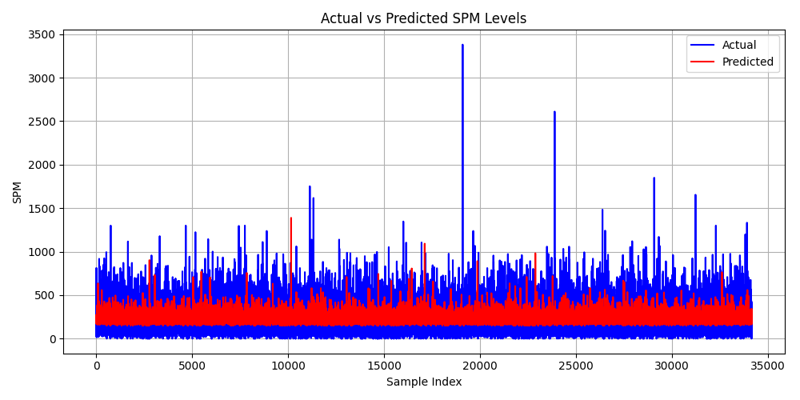
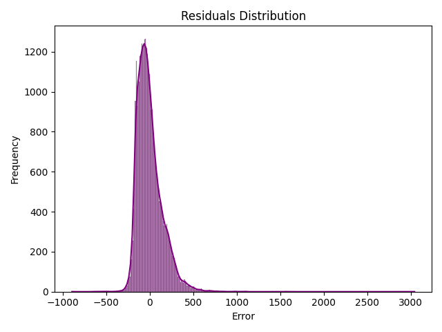
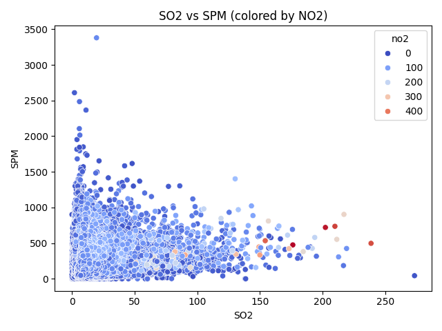

# Model Evaluation Metrics

- **R² Score**: 0.1055
- **Mean Absolute Error (MAE)**: 110.01
- **Mean Squared Error (MSE)**: 21546.16

## 📊 Visual Insights

### 📈 Actual vs Predicted SPM
> The model’s predictions show moderate alignment with actual values, though variability in SPM is not fully captured.

---

### 📉 Residuals Distribution
> Most residuals are centered around zero, but the left-skewed tail suggests occasional underestimation of SPM levels.

---

### 🌡️ SO₂ vs SPM (colored by NO₂)
> This plot highlights how NO₂ concentration influences the SO₂-SPM relationship. Higher NO₂ levels often coincide with elevated SPM.

